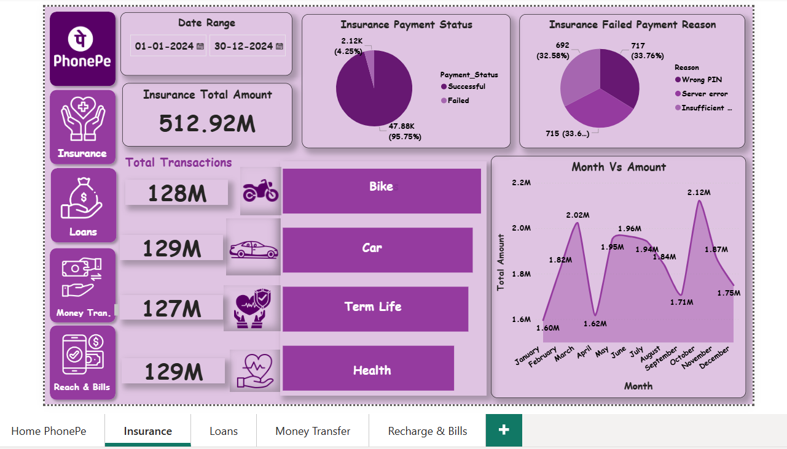
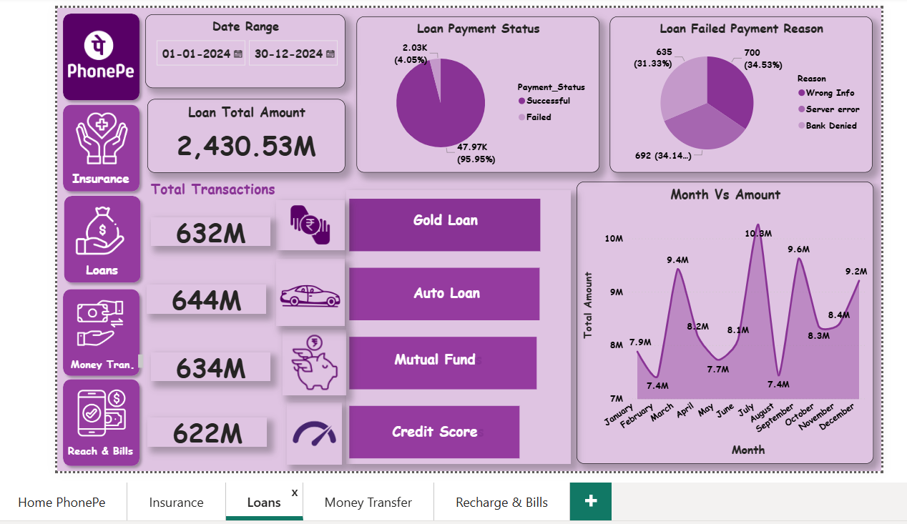

# PhonePe-PowerBI-Dashboard-Analysis
Power BI Dashboard for PhonePe transaction analysis using DAX, Power Query, and interactive visualizations.
Added Power BI file and dashboard screenshots.

# PhonePe Transaction & Financial Services Analysis

## 📊 Project Overview
This comprehensive Power BI dashboard analyzes user behavior, transaction trends, and payment success rates for **PhonePe** across its core financial verticals throughout. The analysis tracks key performance indicators (KPIs) across general transactions, insurance, loans, money transfers, and utility recharges to identify drop-off points and high-volume sectors.

### 🔑 Key High-Level Insights (From Dashboard)
* **Scale of Operations:** Processed a total transaction volume of **3,333M (3.33 Billion)** across **300K total transactions**, yielding an incredibly high average value per transaction.
* **Top Vertical:** **Loans** dominated user transaction value, contributing **102M** out of the key tracked services.
* **Transaction Health:** Maintained a strong **96% payment success rate** across modules, with **Server Errors** and **Wrong PINs** consistently showing up as the top reasons for the 4% failed transactions.
* **Seasonality:** High transaction peaks are observable in **March** and **July**, with sharp volume dips in February and August.

---

## 🛠️ Dashboard Visuals & Breakdown

### 1. Home / Summary
Provides a bird's-eye view of PhonePe’s total transaction amount, success vs. failure trends, and overall monthly performance.

---

### 2. Insurance Performance
Tracks premium payments across Bike, Car, Term Life, and Health insurances, showing balanced transaction amounts (~128M each) across segments.

---

### 3. Loans
An in-depth look at Auto Loans, Gold Loans, Mutual Funds, and Credit Scores. Loans represent a major driving force in overall platform amount metrics.

---

### 4. Money Transfers
Monitors peer-to-peer and peer-to-merchant payments via QR Codes, UPI IDs, Self Accounts, and Mobile Numbers. 

---

### 5. Recharge & Bills
Tracks high-frequency, lower-value transactions including Mobile Recharges, DTH, Cable TV, and Electricity Bill payments.

---

## 🚀 How to View the Project
1. Download the `.pbix` file from this repository.
2. Open it using **Power BI Desktop** to interact with the slicers and date ranges dynamically.
